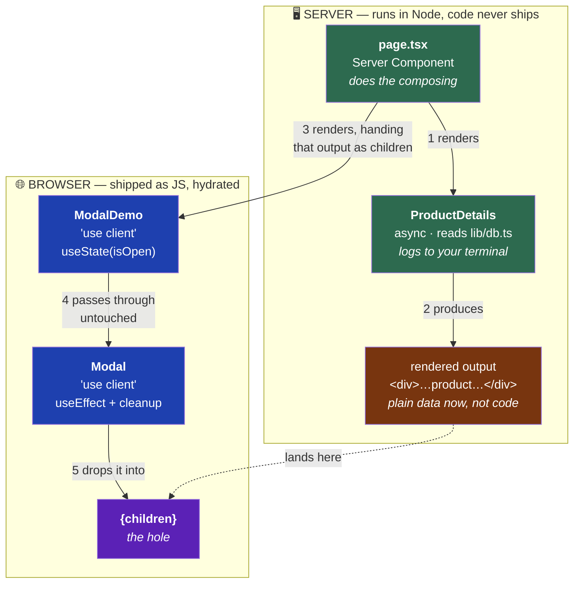
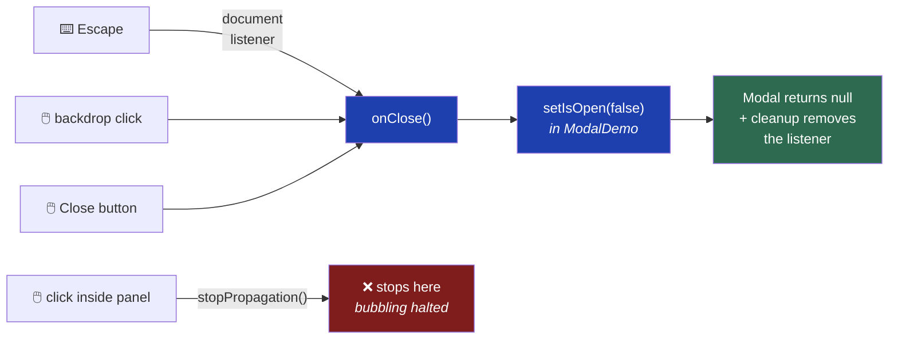

# Phase 4 — Client Components

**7 problems** · Vault folder: `04-client-components`

## Read first

- `NextJs-Vault/04-client-components/Client Components and use client.md`
- `NextJs-Vault/04-client-components/Client Navigation and Hooks.md`
- `NextJs-Vault/04-client-components/Browser APIs and Hydration.md`

## The one idea in this phase

`"use client"` does **not** mean "render only in the browser". It means:

> **Also send this component's code to the browser, so it can become interactive
> there.**

It still renders on the server first. That's why your initial HTML contains the
starting state. What `"use client"` adds is the JavaScript that wakes it up
afterwards — a process called **hydration**.

The cost is bundle size. So the rule is: **push the boundary as far down the tree as
possible.** Make the tiny interactive leaf a Client Component, not the whole page.

## What you're building

Interactivity, plus `app/lab/` routes where you deliberately break things to see how
they fail.

**Create `app/lab/layout.tsx` first** — a plain wrapper with a heading marking these
as experiments.

---

## Problem 1 — Interactive counter

**Goal:** a button that increments a number, inside a page that stays a Server
Component.

**Files:** `app/lab/counter/page.tsx` plus a `Counter` client component

### Steps

1. Create `app/lab/layout.tsx` — a wrapper with an "Experiments" heading
2. Create the `Counter` component with `"use client"` as the **very first line**,
   above the imports
3. `useState` for the count, a button that increments it
4. In `app/lab/counter/page.tsx` — **no directive** — render `<Counter />`

### What you need to know

- `"use client"` must be the **first line in the file**, before every import. Not
  after them, not inside the function.
- The page rendering it stays a Server Component. **A Server Component can render a
  Client Component** — that's normal and correct.

### Verify

1. Clicking increments the number
2. **View Page Source.** The initial count (`0`) is in the HTML — proof that Client
   Components are server-rendered on first load too.

---

## Problem 2 — Search box that writes to the URL

> **Read this framing first — it's what makes the problem make sense.**
>
> You are **not** moving the search input out of `ProductFilter`. `ProductFilter`
> stays exactly as it is. `SearchBox` is a **separate component demonstrating the
> opposite approach.**

**Goal:** typing in the box changes the address bar to `/products?q=headphones`.

**File:** `app/(shop)/products/_components/SearchBox.tsx`

### The two approaches, side by side

Same feature. Completely different architecture.

| | **ProductFilter** (Phase 3) | **SearchBox** (this problem) |
|---|---|---|
| Where state lives | `useState` — browser memory | **the URL** — `?q=headphones` |
| Who filters | the browser, on data it has | the **server**, on the next request |
| URL while typing | never changes | `/products?q=head` |
| Press F5 | filter is **gone** | filter is **still applied** |
| Send the link to a friend | they see everything | they see **your filtered view** |
| Can the server read it? | ❌ no | ✅ yes, via `searchParams` |

Both are valid. `useState` is right for a small list already in memory. The URL is
right when the view should be shareable, bookmarkable, or readable by the server.

### Steps

1. `"use client"` as the first line
2. Import `useRouter`, `useSearchParams`, `usePathname` — all from **`next/navigation`**
3. Read the current term: `searchParams.get("q") ?? ""`
4. Hold a local `useState` seeded with that value, so the input feels instant
5. In a `useEffect`, start a `setTimeout` of ~300ms that writes the value to the URL
6. **Return a cleanup function** that clears the timeout
7. Build the new query with `new URLSearchParams(searchParams.toString())`, then
   `.set("q", value)` — or `.delete("q")` when empty
8. Navigate with **`router.replace`**, passing `{ scroll: false }`
9. In `products/page.tsx`, wrap `<SearchBox />` in **`<Suspense>`** with a fallback

### What you need to know

**The three hooks:**

```
useSearchParams()   READ   the ?q=... part
usePathname()       READ   the /products part
useRouter()         WRITE  navigate to a new URL
```

All from `next/navigation`. **Not `next/router`** — that's the old Pages Router and
will not work here.

**Why local state AND the URL?** The input must feel instant on every keystroke, but
you don't want to rewrite the URL that often. So `useState` is the fast copy; the URL
catches up 300ms later. Seeding it from the URL is what makes a shared link arrive
with the box already filled.

**The debounce.** React runs the cleanup function before the effect runs again, so
each keystroke cancels the pending timer:

```
h · e · a · d        four keystrokes → four timers started
✗   ✗   ✗   ✓        first three cancelled, only the last fires
```

Without the cleanup you get one URL update per letter.

**`replace` vs `push`.** `push` adds a history entry every time. Ten letters, ten
entries, and the Back button is useless. `replace` swaps the current entry.

**The Suspense rule.** `useSearchParams()` forces client-side rendering, because the
server has no idea what `?q=` will be when it prerenders. Next requires a `<Suspense>`
boundary around any component calling it.

> ⚠️ **`npm run dev` will not catch this.** Dev renders on demand, so it appears to
> work. The **production build** fails:
> ```
> ⨯ useSearchParams() should be wrapped in a suspense boundary at page "/products"
> ```
> Delete the boundary and run `npm run build` once so you've seen it.

### Verify

1. Type slowly — the URL updates **once**, ~300ms after you stop, not per letter
2. **Reload the page.** Your search is still there. `useState` alone could never do this.
3. Copy the URL into a new tab — same search, already applied
4. One press of Back leaves the page. (Swap to `push`, type ten letters, and try Back
   again — you'll press it ten times. Then change it back.)
5. `npm run build` passes

### Not in scope

`SearchBox` doesn't have to actually **filter** anything yet. Its only job is getting
the term **into** the URL. Making the server read it back and return matching
products is **Phase 6, Problem 5**.

---

## Problem 3 — Modal

**Goal:** a dialog that closes on Escape and on backdrop click.

**Files:**
- `app/_components/Modal.tsx` — the dialog (client)
- `app/lab/modal/page.tsx` — the demo (server)
- `app/lab/modal/_components/ModalDemo.tsx` — owns `isOpen` (client)
- `app/lab/modal/_components/ProductDetails.tsx` — async, reads the DB (server)

### The mental model

Four components, two runtimes. **Follow the numbers** — the order is the whole
lesson.



🟢 Server · 🔵 Client · 🟤 rendered output · 🟣 the slot it fills

**Read the arrows that are missing.** There is no arrow from `ModalDemo` to
`ProductDetails`. The client components never touch the server one — they only
carry a `children` prop they never inspect. Steps 1–2 finish on the server
*before* step 3 begins.

That's why this is legal:

```
❌ A Client Component cannot IMPORT a Server Component
     → would need server code in the browser bundle
✅ A Client Component CAN RENDER one passed as children
     → receives only the output, which is plain serializable data
```

### The close paths

Three ways in, one way out — plus the one that must **not** get through.



Note where the state lives: `Modal` never owns `isOpen`. It calls `onClose` and
**`ModalDemo`** decides what that means. Delete `stopPropagation` and the red
path turns green — clicking the text you're reading closes the dialog.

### Steps

1. `"use client"`, props for `isOpen`, `onClose`, and `children`
2. Type `children` as `React.ReactNode`
3. In a `useEffect`, add a `keydown` listener on `document`
4. Call `onClose()` when the key is `"Escape"`
5. **Return a cleanup function** that removes the listener
6. Add a backdrop `<div>` whose click calls `onClose`
7. Stop clicks inside the panel from bubbling to the backdrop
8. Then render it **from a Server Component**, passing server-rendered content as
   children

### What you need to know

- **Always clean up listeners.** Without the `return () => ...`, every mount adds
  another listener and they're never removed — a memory leak, and Escape eventually
  fires the handler many times.
- Step 8 is the interesting one: a Client Component **can render** a Server Component
  passed as `children`, even though it **cannot import** one. What's passed isn't the
  component — it's the **already-rendered output**. The server did the work before the
  client ever saw it.

### Verify

1. Escape closes it; clicking the backdrop closes it; clicking inside doesn't
2. Server-rendered children display correctly inside it

---

## Problem 4 — Dropdown

**Goal:** a menu that closes when you click anywhere outside it.

**File:** `app/_components/Dropdown.tsx`

### Steps

1. `"use client"`, `useState` for open/closed
2. `useRef` on the container `<div>`
3. In a `useEffect`, add a `click` listener on `document`
4. In the handler, if `ref.current` does **not** contain the click target, close
5. Clean up the listener
6. Escape also closes it
7. **Then remove `"use client"`** and load the page

### What you need to know

`useRef` gives you the actual DOM node. `ref.current.contains(event.target)` answers
"was this click inside me?" — that's the standard outside-click pattern.

Step 7 is the lesson. Read the error carefully and note **where it happens**: it
fails on the **server**, at render time, because `document` doesn't exist there. Not
in the browser. Server Components run in Node, which has no DOM.

### Verify

1. Clicking outside closes it; clicking inside doesn't
2. You've read the no-`"use client"` error and know it came from the server

---

## Problem 5 — Controlled form

**Goal:** a contact form with client-side validation that never reloads the page.

**File:** `app/(marketing)/contact/_components/ContactForm.tsx`

### Steps

1. `"use client"` first line
2. A `useState` **per field** — name, email, message
3. **Give each one an initial value**: `useState("")`, not `useState()`
4. A `useState` for errors, and one boolean for `isSubmitting`
5. Write a real submit handler:
   ```
   async function handleSubmit(event: React.FormEvent<HTMLFormElement>) { ... }
   ```
   — a normal `function` or `const fn = () => {}`. There is no `const function` syntax.
6. Call `event.preventDefault()` first
7. Validate; on failure set errors and return early
8. Set `isSubmitting` true, then disable the button with it
9. Wire `<form onSubmit={handleSubmit}>`
10. Then **disable JavaScript** in devtools and try again

### What you need to know

- `useState()` with no argument starts as `undefined`, which makes the input
  **uncontrolled**, and React warns when it later becomes controlled. Always
  `useState("")`.
- `preventDefault()` stops the browser's native form submission (a full page reload).
- Step 10 is the point of the whole problem: **with JS disabled the form is completely
  dead.** Nothing happens at all. Keep that in mind — Phase 10 rebuilds this with a
  Server Action that still works without JavaScript.

### Verify

1. Invalid input shows per-field errors with no page reload
2. The button disables while submitting
3. With JS disabled: **nothing happens**. Confirmed.

---

## Problem 6 — Theme toggle with localStorage

**Goal:** a theme choice that survives a full reload, with no hydration warning.

**Files:** `app/lab/hydration/page.tsx`, `app/_components/ThemeToggle.tsx`

### Steps — do it wrong first, on purpose

1. Write the component reading `localStorage` **during render**:
   ```
   const [theme, setTheme] = useState(localStorage.getItem("theme") ?? "light");
   ```
2. Load the page. **Read the console error in full and write down what it says.**
3. **Now fix it:**
   - Start with a fixed default: `useState("light")`
   - Add `const [mounted, setMounted] = useState(false)`
   - In a `useEffect`, read `localStorage` and call both setters
   - While `!mounted`, render a neutral placeholder
4. Write the value back to `localStorage` whenever the theme changes

### What you need to know

**Why the broken version breaks:** the component renders **twice** — once on the
server, once in the browser. The server has no `localStorage`. So the server produces
one HTML output and the browser produces a different one, React compares them, they
don't match, and you get a **hydration mismatch**.

The fix works because `useEffect` **only runs in the browser, after hydration is
finished**. By then React has already matched the two renders successfully.

### Verify

1. The theme survives a full reload
2. **No hydration warning** in the console
3. You wrote down the original error text

---

## Problem 7 — Interactive dashboard filter

**Goal:** the server fetches; the client filters; you can prove the bundle cost of
getting the boundary wrong.

**Files:** `app/dashboard/page.tsx` (server), `app/dashboard/_components/Filters.tsx`
(client)

### Steps

1. Keep `page.tsx` a **Server Component** that fetches and passes data down
2. `Filters.tsx` is the Client Component holding date-range and category state
3. Keep the Client Component **as small as you can** — only the interactive part
4. Use `useMemo` for the filtered result
5. Run `npm run build` and **write down the First Load JS** for `/dashboard`
6. **Now do it wrong:** move `"use client"` to the top of `page.tsx` instead
7. Run `npm run build` again and write down the new number
8. Put it back

### What you need to know

`useMemo` skips recomputing the filtered list when unrelated state changes. With a
small array it doesn't matter; the habit does.

Steps 5–7 are the real exercise. Marking a **high-level** component `"use client"`
turns every component beneath it into a Client Component too — the whole subtree now
ships to the browser. The two numbers are the measurable cost of a badly placed
boundary. That comparison is a strong interview answer.

### Verify

1. Filtering is instant, no network requests
2. You have **both** First Load JS numbers written down

---

## Done when

- Every interactive component works
- You've seen and can describe the hydration mismatch error
- You've seen what happens to a `document`-touching component without `"use client"`
- You have before/after bundle sizes from Problem 7
- The controlled form's death without JS is confirmed
- `npm run build` passes

---

## Recall questions

1. `"use client"` does **not** mean "render only in the browser". What does it
   actually mean? What happens to the component on initial page load?
2. Why does URL state beat `useState` for search and filters? Give three concrete
   benefits.
3. A Client Component accepts `children` from a Server Component. How, if Client
   Components can't import Server Components? What is actually being passed?
4. What is a hydration mismatch? Why does reading `localStorage` during render cause
   one?
5. Why push the client boundary as far down the tree as possible? What is the cost of
   marking a high-level component `"use client"`?
6. Which import path do the App Router navigation hooks come from, and what's the
   wrong one?
7. `router.push` vs `router.replace` — when does the difference matter?

---

## Not yet

No Server Actions (Phase 10). The contact form stays JavaScript-dependent for now —
**that contrast is the point.**
